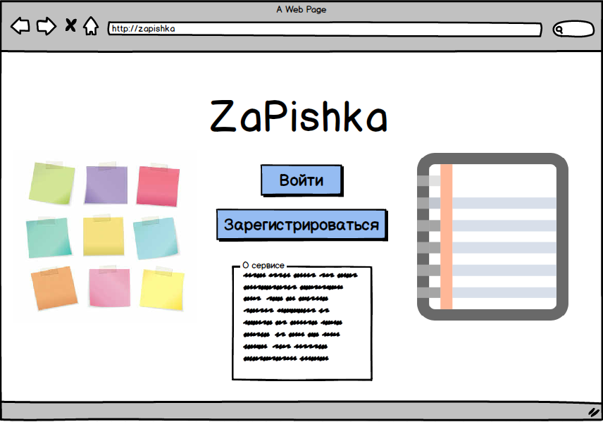
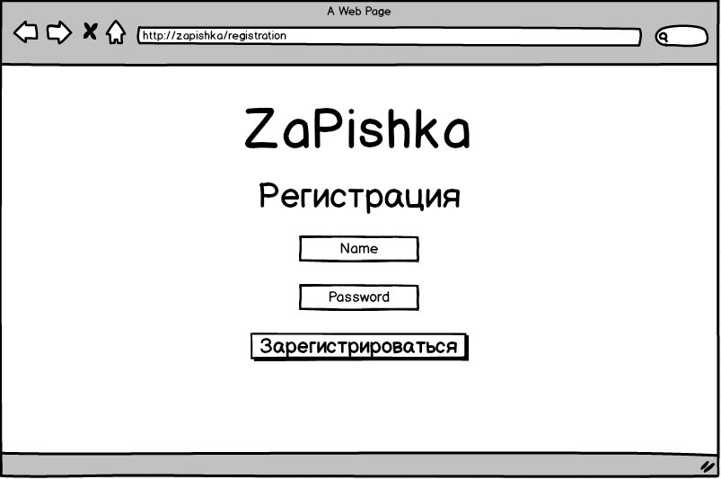
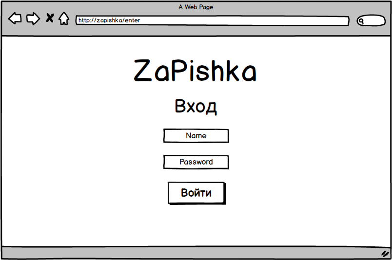
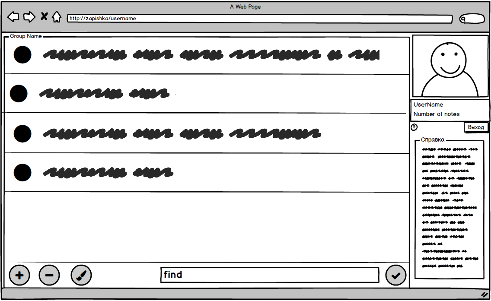
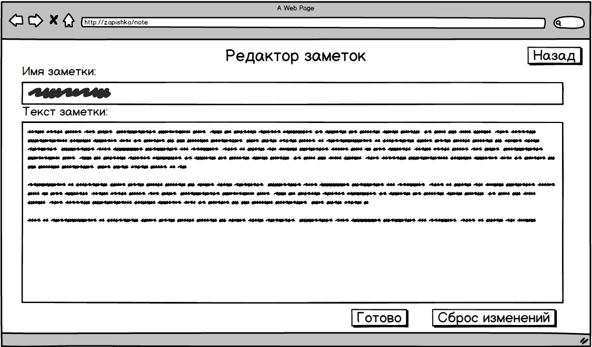

# Требования к проекту
---

# Содержание
1 [Введение](#intro)  
1.1 [Назначение](#appointment)  
1.2 [Бизнес-требования](#business_requirements)  
1.2.1 [Исходные данные](#initial_data)  
1.2.2 [Возможности бизнеса](#business_opportunities)  
1.2.3 [Границы проекта](#project_boundary)  
1.3 [Аналоги](#analogues)  
2 [Требования пользователя](#user_requirements)  
2.1 [Программные интерфейсы](#software_interfaces)  
2.2 [Интерфейс пользователя](#user_interface)  
2.3 [Характеристики пользователей](#user_specifications)  
2.3.1 [Классы пользователей](#user_classes)  
2.3.2 [Аудитория приложения](#application_audience)  
2.3.2.1 [Целевая аудитория](#target_audience)   
2.4 [Предположения и зависимости](#assumptions_and_dependencies)  
3 [Системные требования](#system_requirements)  
3.1 [Функциональные требования](#functional_requirements)  
3.1.1 [Основные функции](#main_functions)  
3.1.1.1 [Вход пользователя в свой акаунт](#login_to_acaunt)  
3.1.1.2 [Добавление новой заметки](#add_new_note)  
3.1.1.3 [Просмотр заметок](#veiw_all_notes)  
3.1.1.4 [Редактирование старой заметки](#edit_old_note)  
3.1.1.5 [Поиск заметки по имени](#find_note_by_name)   
3.1.1.6 [Удаление заметки](#delete_note)   
3.1.1.7 [Выход из акаунта](#logout_from_acaunt)   
3.1.1.8 [Регистрация нового пользователя](#add_new_user)   
3.1.2 [Ограничения и исключения](#restrictions_and_exclusions)    
3.2 [Нефункциональные требования](#non-functional_requirements)  
3.2.1 [Атрибуты качества](#quality_attributes)  
3.2.1.1 [Требования к удобству использования](#requirements_for_ease_of_use)  
3.2.1.2 [Требования к безопасности](#security_requirements)  
3.2.2 [Внешние интерфейсы](#external_interfaces)   

<a name="intro"/>

# 1 Введение

<a name="appointment"/>

## 1.1 Назначение
В этом документе описаны функциональные и нефункциональные требования к web-сайту для заметок «Zapishka» на основе http-сервера. Этот документ предназначен для команды, которая будет реализовывать и проверять корректность работы приложения. 

<a name="business_requirements"/>

## 1.2 Бизнес-требования

<a name="initial_data"/>

### 1.2.1 Исходные данные
В современном мире каждый человек ежедневно сталкивается с огромными потоками информации, которые ему необходимо проанализировать и запомнить. И если перовое обычно не вызывает никаких проблем, то со вторым могут возникнуть некоторые трудности. Традиционным решением данной проблемы является пометить необходимое на различных бумажных носителях: на совещании – в записную книжку, на улице – на небольшой листик или обратную сторону оставшегося чека и т.д. Однако после бумажный носитель может быть утерян либо же просто забыт дома или на рабочем месте. К тому же нередка ситуация, когда необходимость записать что-то появляется неожиданно, а необходимого под рукой нет. Это всё приводит к тому, что человеку не удаётся получить ранее зафиксированную информацию в нужный момент, что зачастую влечёт неприятные последствия.

<a name="business_opportunities"/>

### 1.2.2 Возможности бизнеса
Многие современные люди желают иметь сайт, которое позволит записывать и получать их ифнормацию с любого удобного им устройства, поддерживающих браузер. Подобный сайт позволит им помечать необходимое и смотреть свои пометки с различных устройств, не задумываясь о том где, они их записывали. Спроектированный максимально понятно и удобно для использования интерфейс и дополнение сайта подробной инструкцией позволят увеличить количество людей, использующих данный сайт.

<a name="project_boundary"/>

### 1.2.3 Границы проекта
Сайт для заметок «Zapishka» позволит зарегистрированным пользователям просматривать и записывать свои заметки. Для анонимных пользователей предусмотрена возможность просмотра общих заметок,предоставляющих информацию общего назначения о работе приложения.

<a name="analogues"/>

## 1.3 Аналоги
Обзор аналогов представлен в документе [Overview of analogues](../Requirements/Overview%20of%20analogues.md).   

<a name="user_requirements"/>

# 2 Требования пользователя

<a name="software_interfaces"/>

## 2.1 Программные интерфейсы
Сайт обрабатывает запросы пользователя, согласно протоколу http, и хранит всю информцию в базе данных MongoDB. Приложение реализовано на платформе Spring Framework. 

<a name="user_interface"/>

## 2.2 Интерфейс пользователя
Окно входа в приложение.  
   
Окно регистрации нового пользователя.  
   
Окно авторизации.  
    
Окно рабочего пространства пользователся.  
    
Окно редактирования заметки.  
     

<a name="user_specifications"/>

## 2.3 Характеристики пользователей

<a name="user_classes"/>

### 2.3.1 Классы пользователей

| Класс пользователей | Описание |
|:---|:---|
| Неарегистрированные пользователи | Пользователи, которые не зарегестрировались в приложении. Имеют доступ к общей информации о сервисе |
| Зарегистрированные пользователи | Пользователи, которые вошли в приложение под своим именем (псевдонимом), желающие оставить заметку либо просмотреть свои записи. Имеют доступ к полной функциональности сайта |

<a name="application_audience"/>

### 2.3.2 Аудитория приложения

<a name="target_audience"/>

#### 2.3.2.1 Целевая аудитория
Люди любой возрастной категории, обладающие минимальной компьютерной грамотностью.

<a name="assumptions_and_dependencies"/>

## 2.4 Предположения и зависимости
1. Сайт не работает при отсутствии подключения к Интернету;
2. Сайт не обрабатывает запросы в моменты отключениния сервера.

<a name="system_requirements"/>

# 3 Системные требования

<a name="functional_requirements"/>

## 3.1 Функциональные требования

<a name="main_functions"/>

### 3.1.1 Основные функции

<a name="login_to_acaunt"/>

#### 3.1.1.1 Вход пользователя в свой акаунт
Пользователь имеет возможность войти в свой профиль, где хранятся его записи.

<a name="add_new_note"/>

#### 3.1.1.2 Добавление новой заметки
Авторизированный пользователь может добавть заметку. Также помимо текстовой информации пользователь может прикрпелять файлы специфичной информации(таблицы, диаграммы, картинки и т.д.).

<a name="veiw_all_notes"/>

#### 3.1.1.3 Просмотр заметок
Пользователь имеет возможность просмотреть все свои заметки, сделанные ранее.

<a name="edit_old_note"/>

#### 3.1.1.4 Редактирование старой заметки
Пользователь может по желанию редактировать старые заметки.

<a name="find_note_by_name"/>

#### 3.1.1.5 Поиск заметки по имени
Пользователь имеет возможность найти нужную информацию по имени её заголовка.

<a name="delete_note"/>

#### 3.1.1.6 Удаление заметки
Пользователь имеет возможность удалить ненужную или неактуальную ему заметку.

<a name="logout_from_acaunt"/>

#### 3.1.1.7 Выход из акаунта
Пользователь имеет возможность выйти из акаунта.

<a name="add_new_user"/>

#### 3.1.1.8 Регистрация нового пользователя
Анонимный пользователь имеет возможность зарегистрироваться на сайте.

<a name="restrictions_and_exclusions"/>

### 3.1.2 Ограничения и исключения
1. Сайт работает только при наличии подключения к Интернету;
2. Сайт не обрабатывает запросы в моменты отключениния сервера. 

<a name="non-functional_requirements"/>

## 3.2 Нефункциональные требования

<a name="quality_attributes"/>

### 3.2.1 Атрибуты качества

<a name="requirements_for_ease_of_use"/>

#### 3.2.1.1 Требования к удобству использования
1. Доступ после авторизации к основным функциям сервиса не более чем за две операции;
2. Все функциональные элементы пользовательского интерфейса имеют названия, описывающие действие, которое произойдет при выборе элемента;
3. Пошаговая инструкция использования основных функций сайта отображена в справке;

<a name="security_requirements"/>

#### 3.2.1.2 Требования к безопасности
Приложение предоставляет возможность просмотра записей только того акаунта, из которого был совершен вход.

<a name="external_interfaces"/>

### 3.2.2 Внешние интерфейсы
Окна приложения удобны для использования пользователями с плохим зрением:
  * размер шрифта не менее 14пт;
  * функциональные элементы контрастны фону окна.
Название и символы элементов интерфейса напрямую описывают их функционал.
